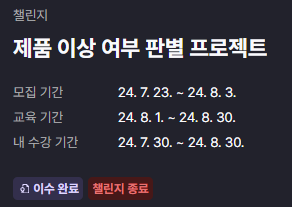
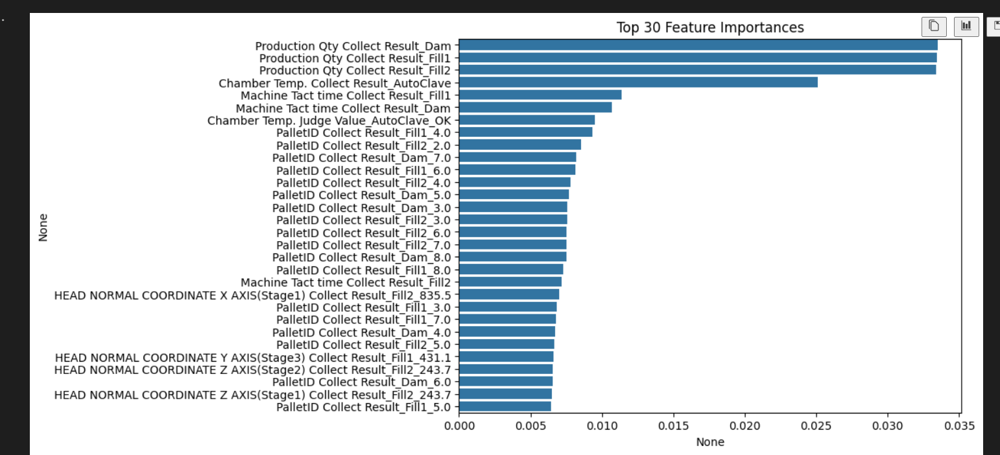

# LgAimers5기 온라인 해커톤 (Phase 2)
최종 제출 코드: code_refactored_onehot_numplus.ipynb  

  
 

## 👉  목차 
1. [🙋 참가팀](#-참가팀)
2. [📰 제품 이상 여부 판별 프로젝트](#-제품-이상-여부-판별-프로젝트)
    - [🚀 최종 결과](#-최종-결과)
    - [🚩 과정](#-과정)
    - [📈 feature importance](#-feature-importance)
    - [📝 개요](#-개요)
3. [🙏 마무리하며..](#-마무리하며)

 

## 🙋 참가팀
**mz호소인**  

|정영호|김채은|이건주|황동혁|정우정|
|---|---|---|---|---|
||||||
|전처리|전처리|전처리 <-> 모델링|모델링|모델링|
 

## 📰 제품 이상 여부 판별 프로젝트
  

### 🚀 최종 결과

 

### 🚩 과정  

(24.08.07 ~ 24.08.30)
데이터전처리: 데이터클리닝  
모델 선정 및 모델링: randomforest, catboost, Xgboost 중 randomforest 선정  
후처리: 칼럼간의 상관관계 파악  
 

### 📈 feature importance

 

### 📝 개요
최근 기계학습 모델의 발전과 함께 제품의 생산 단계에서 이상 여부를 미리 판단하려는 시도가 증가하고 있습니다. 이번 경진대회에서는 공정 과정의 여러 가지 데이터를 이용해 이상 여부를 판별하는 모델을 구현하고 그 성능을 비교하고자 합니다.

#### [데이터 셋 구성]  
센서 데이터 이번 대회에서는 각종 공정 과정에서 발생한 데이터들이 data 폴더 아래 2개의 파일로 제공됩니다. (보안상 리포지토리에서는 제외)

train.csv test.csv 각 칼럼의 의미는 현업 전문가가 설명해주신 영상(LG LMS 내에 『LG 전자 VS본부 해커톤 문제 및 도메인 지식 소개』 모듈)과 일부 칼럼에 대해 주석을 달아주신 [칼럼 설명.xlsx]을 참고해 주세요. 각 칼럼의 이름은 원본 데이터 파일의 이름이 포함되어 있습니다. 칼럼 이름의 형식은 (원본칼럼이름)_(원본파일이름)입니다.

#### [학습용 데이터] 
학습용 데이터는 data/train.csv 으로 제공됩니다. 모델에 입력하는 값인 X변수는 train.csv파일 내의 칼럼 중 target 칼럼을 제외한 모든 칼럼이 해당됩니다. 예측해야 하는 대상인 Y변수는 target 이라는 칼럼으로 제품의 이상 여부를 나타냅니다. AbNormal: 제품에 각종 이상이 있다는 의미입니다. Normal: 제품이 정상이라는 의미입니다.

#### [테스트용 데이터] 
테스트용 데이터는 아래의 제출용 제품의 이상 여부를 예측하기 위한 센서 데이터들이 포함되어 있습니다. 모든 칼럼이 학습용 데이터와 동일하지만, 아래 두 가지 내용이 다릅니다. 제품의 id가 포함되어 있습니다. 이는 제출용 제품 목록의 이상 여부를 채점하기 위해 사용됩니다. target 칼럼이 비어있습니다.

#### [제출용 제품 목록] 
예측 후 제출해야 하는 제품 목록은 submission.csv으로 제공됩니다. 제출용 제품 목록 파일에는 정답이 되는 target이 없습니다. 예측을 통해 target 칼럼을 채워 넣고 제출하세요.

#### [Random state] 
베이스 라인 코드에는 일정한 성능이 나오도록 Seed에 해당하는 RANDOM_STATE 라는 변수가 있습니다. 해당 값은 기본 110으로 설정되어 있으며, 임의로 수정할 수 있습니다.

#### [결과 지표] 
경진대회의 결과 지표를 계산하기 위해서 분류(classification) 지표인 F1 Score를 활용합니다. 이번 대회에서 사용하는 데이터 셋은 AbNormal과 Normal의 개수 차이가 심한 편으로, 예측해야 하는 대상인 AbNormal을 기준으로 F1 Score를 계산합니다.

#### [채점 방법] 
채점을 위해 submission.csv 파일을 읽고 저장해야 합니다. 읽은 파일을 위의 안내의 따라 값을 채워 넣은 후에 나온 테스트 데이터를 학습된 모델에 적용합니다. 모델에서 나온 예측 결과는 아래와 같은 형태의 CSV 파일로 저장하여야 합니다. 파일 이름은 submission.csv로 해야 합니다. 초기 디렉터리에 submission.csv파일을 저장하였다면, 오른쪽 위의 제출 버튼을 클릭해 결과를 확인할 수 있습니다.

#### [데이터 칼럼] 
**DISCHARGED SPEED OF RESIN Collect Result_Dam** : Resin 토출 Speed  
**DISCHARGED TIME OF RESIN(Stage1) Collect Result_Dam** : ****Resin 토출 시간(Stage 1 : CID)  
**DISCHARGED TIME OF RESIN(Stage2) Collect Result_Dam** : ****Resin 토출 시간(Stage 2 : Seg)  
**DISCHARGED TIME OF RESIN(Stage3) Collect Result_Dam** : Resin 토출 시간(Stage 3 : Cluster)  
**Dispense Volume(Stage1) Collect Result_Dam** : Resin 토출량 (CID)  
**Dispense Volume(Stage2) Collect Result_Dam** : Resin 토출량 (Seg)  
**Dispense Volume(Stage3) Collect Result_Dam** : Resin 토출량 (Cluster)  
**HEAD NORMAL COORDINATE X AXIS(Stage1) Collect Result_Dam** : 토출좌표  
**HEAD NORMAL COORDINATE X AXIS(Stage2) Collect Result_Dam** : 토출좌표  
**HEAD NORMAL COORDINATE Z AXIS(Stage3) Collect Result_Dam** : 토출좌표  
**HEAD Standby Position X Collect Result_Dam** : 토출대기좌표  
**HEAD Standby Position Y Collect Result_Dam** : 토출대기좌표  
**HEAD Standby Position Z Collect Result_Dam** : 토출대기좌표  
**Head Clean Position X Collect Result_Dam** : 노즐클린 좌표  
**Head Clean Position Y Collect Result_Dam** : 노즐클린 좌표  
**Head Clean Position Z Collect Result_Dam** : 노즐클린 좌표  
**Head Purge Position X Collect Result_Dam** : Resin Drain 좌표  
**Head Purge Position Y Collect Result_Dam** : Resin Drain 좌표  
**Head Purge Position Z Collect Result_Dam** : Resin Drain 좌표  
**Head Zero Position X Collect Result_Dam** : Zero 좌표  
**Head Zero Position Y Collect Result_Dam** : Zero 좌표  
**Head Zero Position Z Collect Result_Dam** : Zero 좌표  
**Machine Tact time Collect Result_Dam** : DAM공정소요시간  
**PalletID Collect Result_Dam** : PalletID  
**Production Qty Collect Result_Dam** : -  
**Receip No Collect Result_Dam** : -  
**Stage1 Circle1 Distance Speed Collect Result_Dam** : CID #1 R 수치  
**Stage1 Circle2 Distance Speed Collect Result_Dam** : CID #2 R 수치  
**Stage1 Circle3 Distance Speed Collect Result_Dam** : CID #3 R 수치  
**Stage1 Circle4 Distance Speed Collect Result_Dam** : CID #4 R 수치  
**Stage1 Line1 Distance Speed Collect Result_Dam** : CID#1 토출 스피드  
**Stage1 Line2 Distance Speed Collect Result_Dam** : CID#2 토출 스피드  
**Stage1 Line3 Distance Speed Collect Result_Dam** : CID#3 토출 스피드  
**Stage1 Line4 Distance Speed Collect Result_Dam** : CID#4 토출 스피드  
**Stage2 Circle1 Distance Speed Collect Result_Dam** : Seg #1 R 수치  
**Stage2 Circle2 Distance Speed Collect Result_Dam** : Seg #2 R 수치  
**Stage2 Circle3 Distance Speed Collect Result_Dam** : Seg #3 R 수치  
**Stage2 Circle4 Distance Speed Collect Result_Dam** : Seg #4 R 수치  
**Stage2 Line1 Distance Speed Collect Result_Dam** : Seg#1 토출 스피드  
**Stage2 Line2 Distance Speed Collect Result_Dam :** Seg#2 토출 스피드  
**Stage2 Line3 Distance Speed Collect Result_Dam** : Seg#3 토출 스피드  
**Stage2 Line4 Distance Speed Collect Result_Dam** : Seg#4 토출 스피드  
**Stage3 Circle1 Distance Speed Collect Result_Dam** : Cluser #1 R 수치  
**Stage3 Circle2 Distance Speed Collect Result_Dam** : Cluser #2 R 수치  
**Stage3 Circle3 Distance Speed Collect Result_Dam** : Cluser #3 R 수치  
**Stage3 Circle4 Distance Speed Collect Result_Dam** : Cluser #4 R 수치  
**Stage3 Line1 Distance Speed Collect Result_Dam** : Clsuter#1 토출 스피드  
**Stage3 Line2 Distance Speed Collect Result_Dam** : Clsuter#2 토출 스피드  
**Stage3 Line3 Distance Speed Collect Result_Dam** : Clsuter#3 토출 스피드  
**Stage3 Line4 Distance Speed Collect Result_Dam** : Clsuter#4 토출 스피드  
**THICKNESS 1 Collect Result_Dam** : -  
**THICKNESS 2 Collect Result_Dam** : -  
**THICKNESS 3 Collect Result_Dam** : -  

## 🙏 마무리하며..
머신러닝에 대해 처음 도전하였지만 많은 것을 배우며 생각보다 좋은 결과가 나왔다. 그래서 그런지 더욱 아쉬움이 남는 것 같다.  
막판에 점수를 올리지 못하여 19위에서부터 되게 많이 밀려나 매우 아쉽다.  
다음 기수에도 참가하여 본선에 꼭 가보고 싶다.
